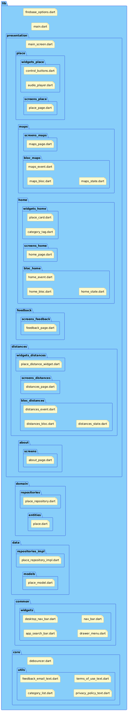

<h1 align="center" style="display:flex; flex-direction: row; justify-content: center; align-items: center">

</h1>

## Sobre o projeto :purple_heart: :yellow_heart:

O Siga Cidades é um aplicativo mobile que visa oferecer informações de pontos de interesse do município, como praças, ruas, avenidas, prédios, equipamentos públicos e espaços de lazer. O seu diferencial é apresentar os dados por meio de áudios com informações gerais e, principalmente, audiodescrição detalhada de aspectos físicos e estéticos de cada local, como estilo arquitetônico, características estruturais e dimensões. Cada arquivo pode ser acessado em um mapa, o que permite ao usuário relacionar os pontos de interesse e sua localização na cidade.

O aplicativo busca oferecer informação acessível e diversificada e, dessa maneira, contribuir para que as pessoas conheçam melhor as cidades e possam experienciá-las com mais autonomia e independência. Nesse sentido, tem como público preferencial (mas não exclusivo) o de pessoas com deficiência visual, principalmente porque oferece o diferencial da audiodescrição e do formato sonoro dos arquivos.

---

## Sobre os diretórios e arquitetura.

 

 

O projeto foi estruturado seguindo a arquitetura em camadas e segue os princípios do Clean Architecture em conjunto com o padrão BLoC, organizado nas seguintes camadas:

### 1. Camada de Apresentação (`/presentation`)

- Contém todos os componentes relacionados à UI e implementações BLoC
- Subdividida em:
  - `main_screen.dart`: Componente orquestrador da estrutura base do app
  - `place/`: Componentes relacionados a lugares
    - `widgets/`: Widgets específicos para lugares
    - `screens/`: Página específica de lugares
    - `bloc/`: Implementações BLoC para funcionalidades de lugares
  - `maps/`: Componentes relacionados ao mapa
    - `screens/`: Página específica de mapa
    - `bloc/`: Implementações BLoC específicos para mapas
  - `home/`: Componentes da seção inicial
    - `widgets/`: Widgets específicos da home
    - `screens/`: Página específica da home
    - `bloc/`: Implementações BLoC para funcionalidades da home
  - `feedback/`: Componentes do sistema de feedback
    - `screens/`: Página específica de feedback
  - `distances/`: Componentes que exibe a distância dos lugares em relação ao usuário
    - `widgets/`: Widgets relacionados a distância
    - `screens/`: Página específica de distância
    - `bloc/`: Implementações BLoC para funcionalidades de distância
  - `about/`: Componentes da seção sobre
    - `screens/`: Página específica sobre

### 2. Camada de Domínio (`/domain`)

- Inclui:
  - `repositories/`: Interface do repositório
  - `entities/`: Entidade principal (`place.dart`)

### 3. Camada de Dados (`/data`)

- Contém:
  - `repositories/`: Implementação concreta do repositório
  - `models/`: Modelos de dados e transformações

### 4. Camada Comum (`/common`)

- Subdividida em:
  - `widgets/`: Widgets genéricos reutilizáveis
    - `desktop_nav_bar.dart`: Barra de navegação para desktop
    - `nav_bar.dart`: Barra de navegação para dispositivos móveis
    - `app_search_bar.dart`: Barra de pesquisa de lugares
    - `drawer_menu.dart`: Menu lateral para escolha de cidades

### 5. Core (`/core`)

- Contendo:
  - `core/`: Componentes fundamentais
    - `utils/`: Utilitários
      - `feedback_email_text.dart`: Template de email para feedback
      - `terms_of_use_text.dart`: Texto dos termos de uso
      - `category_list.dart`: Lista de categorias
      - `privacy_policy_text.dart`: Texto da política de privacidade

## Objetivos da arquitetura:

1. **Separação de Responsabilidades**: Cada camada tem uma responsabilidade bem definida para facilitar a manutenção.

2. **Escalabilidade**: Adição de novos recursos de forma mais fácil.

3. **Desacoplamento**: Reduz dependências entre componentes.

---

<h4 align="center" style="display:flex; flex-direction: row; justify-content: center; align-items: center">

- #### [Biblioteca Falada](https://bibliotecafalada.unesp.br/)

</h4>
